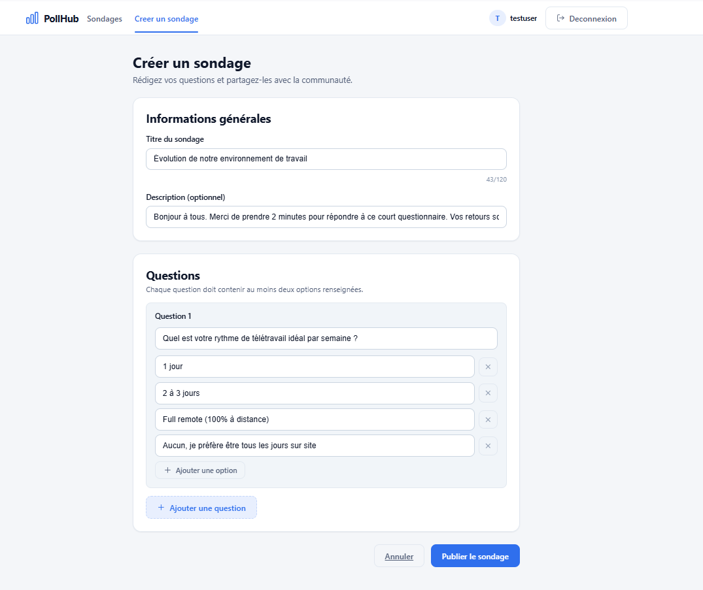
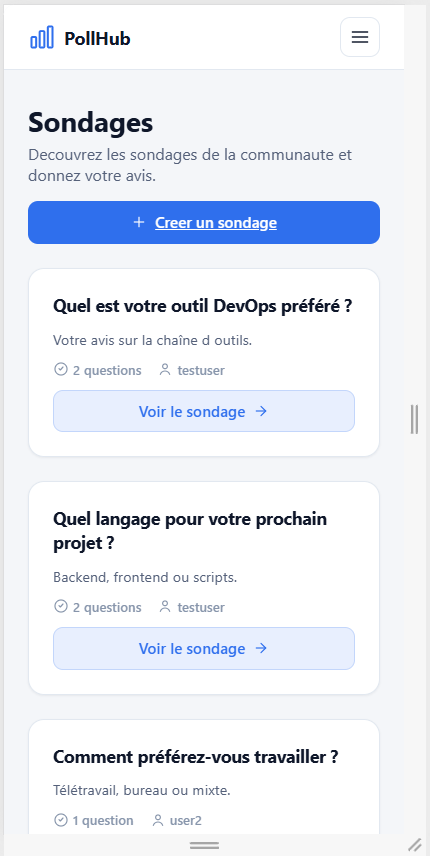
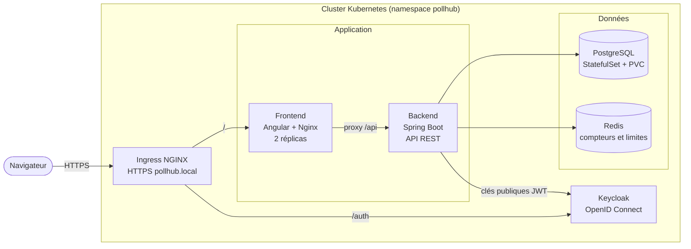
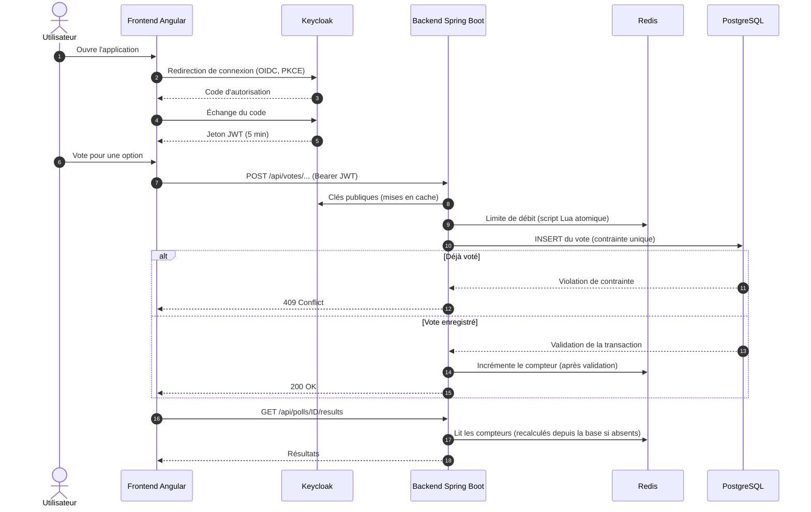
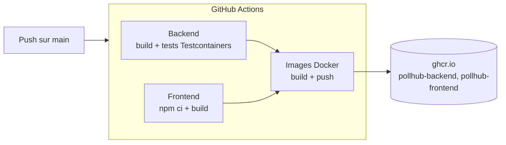

# PollHub

Application de sondages multi-questions, conçue comme un projet **DevOps de bout en bout** : API sécurisée, authentification centralisée, déploiement sur Kubernetes, pipeline CI/CD et tests d'intégration.

[](https://github.com/mededema/pollhub/actions)
[](LICENSE)


| Vote et résultats | Création d'un sondage | Vue mobile |
|---|---|---|
|  |  |  |

L'application est volontairement simple : l'intérêt du projet est tout ce qu'il y a autour (sécurité, fiabilité, déploiement, automatisation).

## Fonctionnalités

- Sondages à **plusieurs questions**, chacune avec 2 à 10 options
- Authentification **OpenID Connect** (Keycloak), jetons JWT, API sans état
- **Un vote par question et par utilisateur**, garanti par une contrainte unique en base
- Limitation du nombre de votes par minute (anti-abus, Redis)
- Résultats visibles après avoir voté (le créateur les voit toujours), mis à jour en direct
- Le créateur peut supprimer ses sondages, avec confirmation
- Interface responsive, thème clair et sombre automatique, navigation au clavier, respect de la préférence « réduire les animations »

## Architecture



| Composant | Technologie | Rôle |
|---|---|---|
| Frontend | Angular 22, Nginx | Interface, proxy `/api` vers le backend |
| Backend | Spring Boot 3.2, Java 21 | API REST, resource server OAuth2 |
| Authentification | Keycloak 23 | Comptes, connexion, jetons JWT |
| Base de données | PostgreSQL 15 | Stockage durable (StatefulSet + volume persistant) |
| Cache et anti-abus | Redis 7 | Compteurs de votes, limitation de débit |
| Orchestration | Kubernetes (Minikube) | Déploiement, sondes de santé, ressources |
| CI/CD | GitHub Actions, ghcr.io | Build, tests, publication des images |

## Connexion et vote



## Pipeline CI/CD



Les images ne sont publiées que si le backend et le frontend passent. Sur une pull request, seuls les builds et les tests tournent.

## Fiabilité et sécurité

- **Pas de double vote, même en cas de requêtes simultanées** : une contrainte unique `(question, votant)` en base fait foi. Le contrôle applicatif ne sert qu'à renvoyer un message clair.
- **Compteurs Redis cohérents** : ils ne sont mis à jour qu'après la validation de la transaction. Si Redis est indisponible ou a perdu ses données, la clé est supprimée puis recalculée depuis PostgreSQL à la lecture suivante.
- **Limitation de débit atomique** : incrément et expiration dans un seul script Lua, sans clé orpheline possible.
- **Validation côté serveur** : longueurs maximales, nombre de questions et d'options, date d'expiration dans le futur, validation en profondeur des questions imbriquées.
- **Erreurs JSON homogènes** : toutes les erreurs, y compris 401 et 403 de Spring Security, ont la même forme (`status`, `error`, `message`, `path`, `fieldErrors`), sans trace d'exécution exposée.
- **API sans état** : chaque requête est validée par son jeton JWT, aucune session côté serveur.
- **Sondes Kubernetes** : liveness, readiness, et startupProbe pour Keycloak (démarrage lent).
- **HTTPS** : requis par le navigateur pour l'API Web Crypto utilisée par PKCE.
- **Images multi-étapes** : les images finales ne contiennent ni Maven ni Node.

## Démarrage rapide (Docker Compose)

```bash
git clone https://github.com/mededema/pollhub.git
cd pollhub
docker compose up --build
```

Ouvrir http://localhost:4200. Comptes de **démonstration** : `testuser` / `Password123!` et `user2` / `Password123!`.

## Déploiement sur Kubernetes (Minikube)

```bash
minikube start --memory=4096 --cpus=2
minikube addons enable ingress

# Images construites directement dans Minikube
minikube image build -t pollhub-backend:local ./backend
minikube image build -t pollhub-frontend:local ./frontend

# Certificat TLS auto-signé (démo)
openssl req -x509 -nodes -days 365 -newkey rsa:2048 \
  -keyout tls.key -out tls.crt -subj "/CN=pollhub.local" \
  -addext "subjectAltName=DNS:pollhub.local"

kubectl apply -f k8s/00-namespace.yaml
kubectl create secret tls pollhub-tls --cert=tls.crt --key=tls.key -n pollhub
kubectl create configmap keycloak-realm --from-file=keycloak/pollhub-realm.json -n pollhub
kubectl apply -f k8s/
kubectl get pods -n pollhub -w
```

Ajouter `127.0.0.1 pollhub.local` au fichier `hosts`, lancer `minikube tunnel`, puis ouvrir **https://pollhub.local** (accepter l'avertissement du certificat auto-signé). Keycloak met 2 à 4 minutes à démarrer.

Pour utiliser les images publiées par la CI :

```bash
kubectl set image deploy/backend backend=ghcr.io/mededema/pollhub-backend:latest -n pollhub
kubectl set image deploy/frontend frontend=ghcr.io/mededema/pollhub-frontend:latest -n pollhub
```

## Configuration du backend

| Variable | Rôle | Valeur par défaut |
|---|---|---|
| `POSTGRES_HOST`, `POSTGRES_DB`, `POSTGRES_USER`, `POSTGRES_PASSWORD` | Connexion PostgreSQL | `localhost`, `pollhub`, `pollhub`, `pollhub` |
| `REDIS_HOST` | Hôte Redis | `localhost` |
| `KEYCLOAK_ISSUER_URI` | Émetteur attendu dans les jetons | `http://localhost:8082/realms/pollhub` |
| `POLLHUB_MAX_VOTES_PER_MINUTE` | Votes maximum par utilisateur et par minute | `30` |
| `POLLHUB_CORS_ALLOWED_ORIGINS` | Origines autorisées, séparées par des virgules | `http://localhost:4200` |

## API

| Méthode | Route | Authentification | Réponses |
|---|---|---|---|
| GET | `/api/polls`, `/api/polls/{id}` | Non | 200, 404 |
| GET | `/api/polls/{id}/results` | Oui (après un vote, ou créateur) | 200, 401, 403 |
| GET | `/api/polls/my` | Oui | 200, 401 |
| POST | `/api/polls` | Oui | 201, 400 |
| DELETE | `/api/polls/{id}` | Oui (propriétaire) | 200, 403, 404 |
| POST | `/api/votes/questions/{questionId}/options/{optionId}` | Oui | 200, 400, 404, 409, 410, 429 |
| GET | `/actuator/health` | Non | 200 |

## Tests

Les tests d'intégration démarrent de vrais PostgreSQL et Redis avec **Testcontainers** : aucune base à installer, seul Docker est nécessaire.

```bash
cd backend
mvn test
```

Scénarios couverts : création valide et invalide (champs manquants, listes nulles, textes vides), vote, double vote, **10 votes simultanés du même utilisateur** (un seul enregistré, compteur cohérent), sondage expiré, règles d'accès aux résultats, suppression par un tiers puis par le propriétaire avec des votes existants, erreurs 401 au format JSON.

## Structure du dépôt

```
pollhub/
├── backend/        API Spring Boot, tests Testcontainers, Dockerfile
├── frontend/       Application Angular, Nginx, Dockerfile
├── k8s/            Manifests Kubernetes (namespace, config, postgres, redis, keycloak, backend, frontend, ingress)
├── keycloak/       Realm importé automatiquement au démarrage
├── docs/           Captures d'écran
├── .github/        Pipeline GitHub Actions
└── docker-compose.yml
```

## Limites connues et pistes d'amélioration

- Identifiants et secrets de **démonstration** dans le dépôt : en production, Sealed Secrets ou Vault.
- Certificat auto-signé : en production, cert-manager et Let's Encrypt.
- Keycloak en mode `start-dev` avec base interne : en production, `start` avec une base PostgreSQL dédiée.
- Le jeton expire après 5 minutes et n'est pas renouvelé automatiquement côté interface.
- Pistes : chart Helm, monitoring Prometheus et Grafana, déploiement continu avec Argo CD.

## Licence

MIT