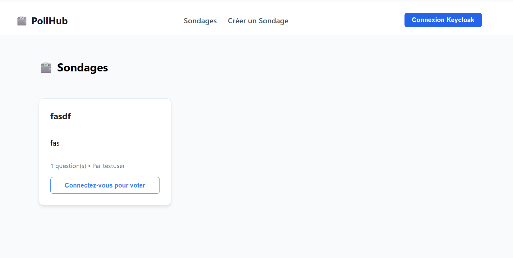
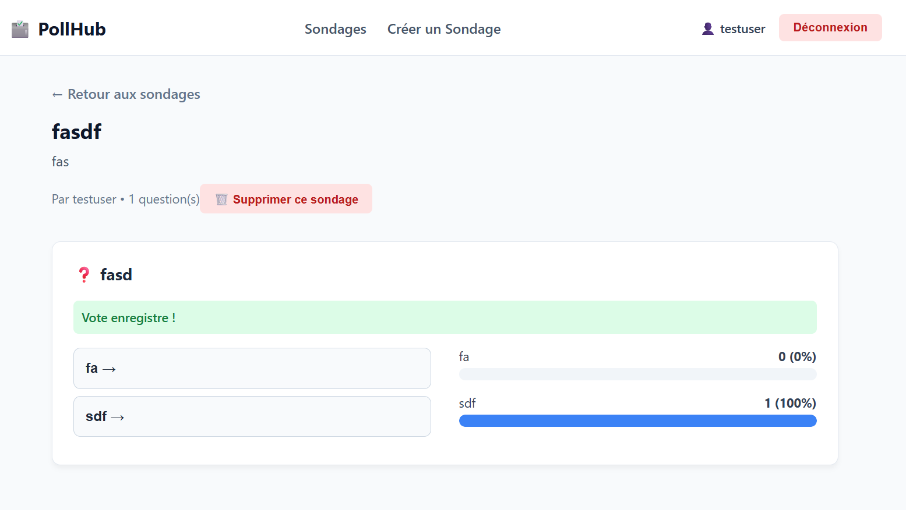
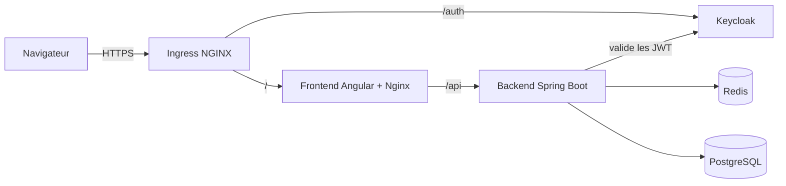

# PollHub

Application de sondages multi-questions, déployée sur **Kubernetes** avec authentification **Keycloak**, anti-abus **Redis** et pipeline **CI/CD GitHub Actions**.

[](https://github.com/mededema/pollhub/actions)
[](LICENSE)

> Projet portfolio axé **DevOps / Kubernetes** : l'application est volontairement simple, l'intérêt est dans l'écosystème autour.




## Fonctionnalités

- Sondages avec **plusieurs questions**, chacune avec plusieurs options
- Authentification **OpenID Connect** (Keycloak) avec jetons JWT
- Un vote par question et par utilisateur, limite de **5 votes/minute** (Redis)
- Résultats visibles après avoir voté (le créateur les voit toujours)
- Le créateur peut supprimer ses sondages

## Architecture



| Composant | Technologie | Rôle |
|---|---|---|
| Frontend | Angular 22, Nginx | Interface, proxy `/api` vers le backend |
| Backend | Spring Boot 3.2, Java 21 | API REST, Resource Server OAuth2 |
| Auth | Keycloak 23 | Utilisateurs, connexion, jetons JWT |
| Cache / anti-abus | Redis 7 | Compteurs de votes, rate limiting |
| Base de données | PostgreSQL 15 | Stockage durable (StatefulSet + PVC) |
| Orchestration | Kubernetes (Minikube) | Déploiement, probes, ressources |
| CI/CD | GitHub Actions, ghcr.io | Build et publication des images |

## Lancer avec Docker Compose

```bash
git clone https://github.com/mededema/pollhub.git
cd pollhub
docker compose up --build
```

Ouvrir http://localhost:4200. Comptes de **démonstration** : `testuser` / `Password123!` et `user2` / `Password123!`.

## Déployer sur Kubernetes (Minikube)

```bash
minikube start --memory=4096 --cpus=2
minikube addons enable ingress

# Images construites dans Minikube
minikube image build -t pollhub-backend:local ./backend
minikube image build -t pollhub-frontend:local ./frontend

# Certificat TLS auto-signé (démo)
openssl req -x509 -nodes -days 365 -newkey rsa:2048 \
  -keyout tls.key -out tls.crt -subj "/CN=pollhub.local" \
  -addext "subjectAltName=DNS:pollhub.local"

kubectl apply -f k8s/00-namespace.yaml
kubectl create secret tls pollhub-tls --cert=tls.crt --key=tls.key -n pollhub
kubectl create configmap keycloak-realm --from-file=keycloak/pollhub-realm.json -n pollhub
kubectl apply -f k8s/
kubectl get pods -n pollhub -w
```

Ajouter `127.0.0.1 pollhub.local` au fichier `hosts`, lancer `minikube tunnel`, puis ouvrir **https://pollhub.local** (accepter l'avertissement du certificat auto-signé).

### Utiliser les images publiées (ghcr.io)

```bash
kubectl set image deploy/backend backend=ghcr.io/mededema/pollhub-backend:latest -n pollhub
kubectl set image deploy/frontend frontend=ghcr.io/mededema/pollhub-frontend:latest -n pollhub
```

## API

| Méthode | Route | Auth |
|---|---|---|
| GET | `/api/polls`, `/api/polls/{id}` | Non |
| GET | `/api/polls/{id}/results` | Oui (après avoir voté, ou créateur) |
| GET | `/api/polls/my` | Oui |
| POST | `/api/polls` | Oui |
| DELETE | `/api/polls/{id}` | Oui (propriétaire) |
| POST | `/api/votes/questions/{questionId}/options/{optionId}` | Oui |
| GET | `/actuator/health` | Non |

## Choix techniques

- **StatefulSet pour PostgreSQL** : identité stable et volume persistant dédié.
- **Redis** : compteurs atomiques (`INCR`) et expiration native pour le rate limiting.
- **Probes liveness / readiness / startup** : Kubernetes redémarre ce qui plante et n'envoie du trafic qu'aux pods prêts. La `startupProbe` de Keycloak évite qu'il soit tué pendant son long démarrage.
- **Un seul point d'entrée (Ingress)** : seuls `/` et `/auth` sont exposés, `/api` passe par le Nginx du frontend.
- **HTTPS** : requis par le navigateur pour l'API Web Crypto (PKCE de Keycloak).
- **Multi-stage builds** : images finales légères, sans Maven ni Node.

## Limites connues et pistes d'amélioration

- Identifiants et secrets de **démo** dans le dépôt : en production, Sealed Secrets / Vault.
- Certificat auto-signé : en production, cert-manager + Let's Encrypt.
- Keycloak en mode `start-dev` avec base interne : en production, `start` avec PostgreSQL dédié.
- Tests d'intégration à ajouter avec Testcontainers (désactivés en CI pour l'instant).
- Prochaines étapes : Helm chart, monitoring Prometheus/Grafana, déploiement automatique (Argo CD).

## Licence

MIT